# BL4 Save Editor

An offline save editor for **Borderlands 4**, in the spirit of Gibbed's
Borderlands 2 editor. A single `BL4SaveEditor.exe`: the game database, item
icons and everything else are embedded.

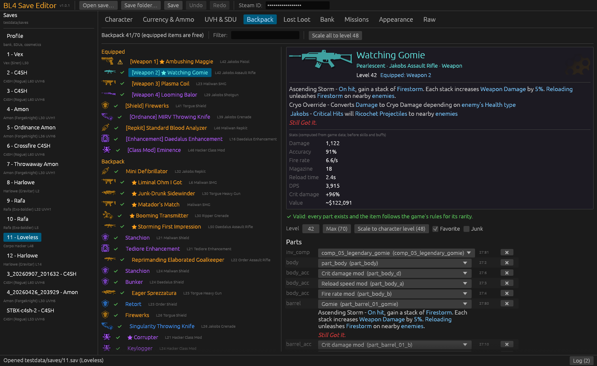

## Features

| Area | What you can do |
|---|---|
| **Saves** | Lists every character in the save folder (name, class, level, UVH). Opens a character together with `profile.sav` (bank, SDUs and cosmetics live there). |
| **Backups** | The moment a save is opened, the character and `profile.sav` are copied to `bl4editor_backups\<name>_<date>-<time>.sav` next to the saves. |
| **Safety** | Saving is **blocked while Borderlands 4 is running** (the game keeps the character in memory and would overwrite the edit). Before writing, the editor re-checks the save structure, writes to a temp file and renames it into place. Unedited saves are written back byte-for-byte identical. |
| **Character** | Name, level and XP (written together the way the game stores them), specialization level, difficulty, True Mode, spawn checkpoint (any fast-travel or respawn station from the game data). |
| **Currency & ammo** | Cash, eridium, SDU tokens, Vault Card tokens, ammo (fill to max). Golden keys are shown read-only: SHiFT holds them server-side. |
| **UVH & SDU** | Unlock UVH 1–7 (rank-up challenges marked done) and pick the active UVH level; unlock weapon 3/4, repkit, enhancement and class-mod slots; buy SDU upgrades per group or all at once. |
| **Backpack / Bank / Lost Loot** | Gibbed-style item list with type icon, rarity color and validity marker. Item card with name, rarity, manufacturer logo, element, firmware, legendary red text and **computed stats**. Each part in a dropdown limited to that slot; add/remove parts; level; favorite/junk; copy/paste serial codes; duplicate; move between backpack and bank; delete. Build a new item from any item type + rarity. Capacity is enforced (backpack 16 + SDUs with equipped items free, bank 25 + SDUs): the game deletes overflow on load, so adding past it is refused. Lost Loot items can be moved to the backpack. |
| **Validity check** | Every item is checked against the game data before you add it, and again for every item before saving (you are asked before an item the game would reject is written): unknown parts or parts from pools the item type cannot use are **errors** (the game parks such items in `unknown_items`, i.e. they vanish); unusual combinations (too many parts in a slot, parts a rarity cannot roll, tag conflicts, parts that only exist with a mod installed) are **warnings**. |
| **Missions** | Every mission set with real names and status; complete a set, a single mission, or the whole main story; reset a set; set the status of each objective of an active mission (the in-mission checkpoints). |
| **Appearance** | Change the equipped head, body, skin, ECHO-4 and vehicle cosmetics (unlocked ones only); unlock cosmetics per group or all (pre-order/premium/SHiFT items excluded unless you tick the box). |
| **Raw** | The decrypted YAML of the character or profile, searchable and editable (checked before it is applied). |
| **Undo/Redo** | Every edit (Ctrl+Z / Ctrl+Y). |

## Screenshots

| | |
|---|---|
| 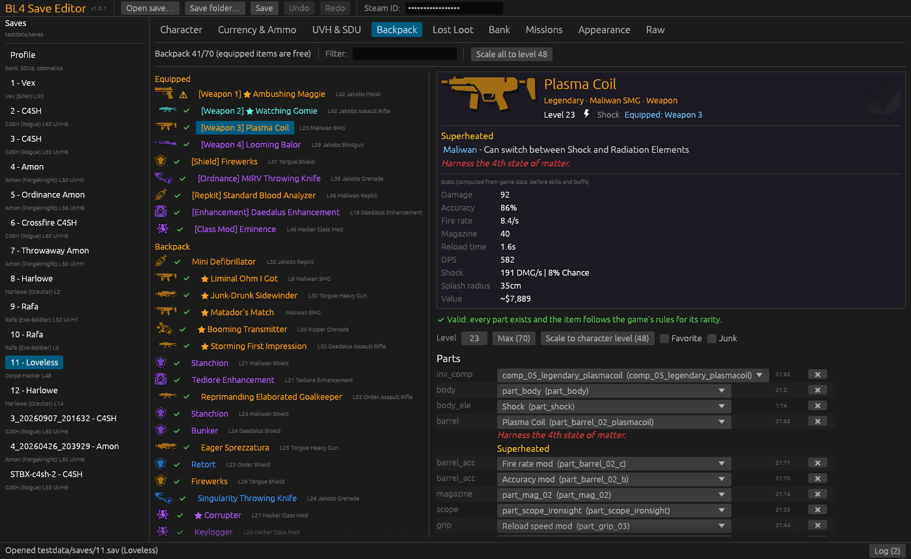 | 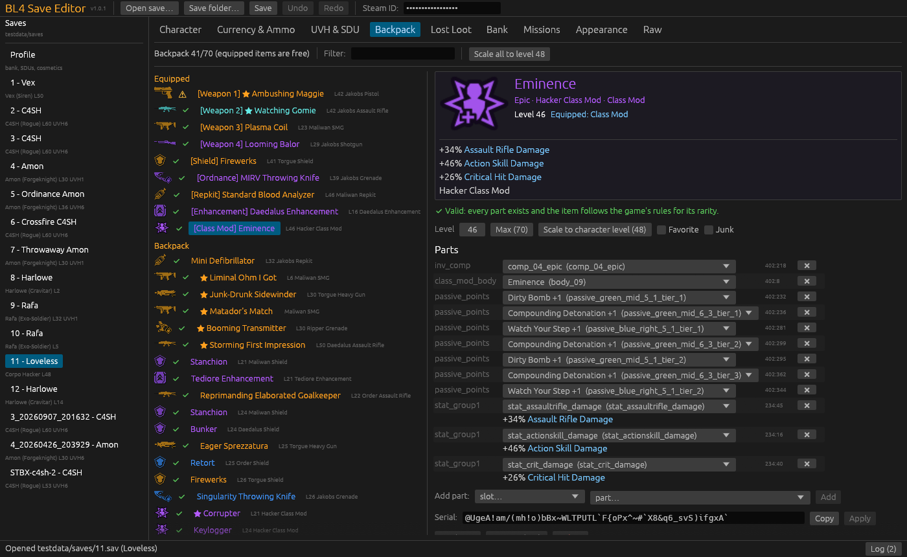 |
| 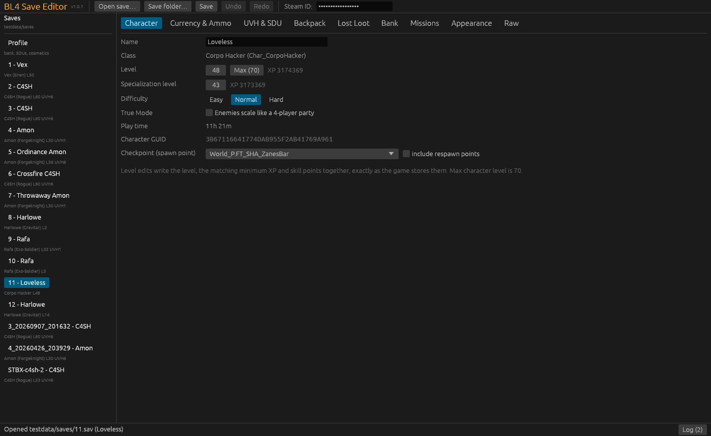 | 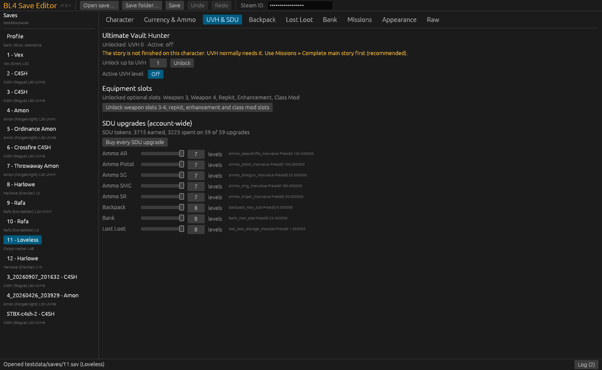 |
| 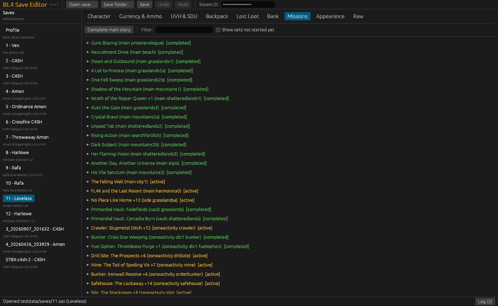 | 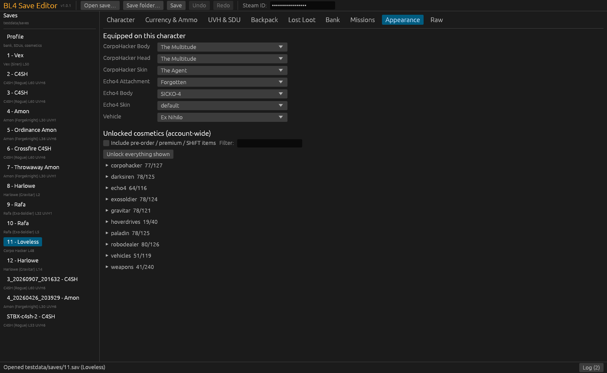 |
| 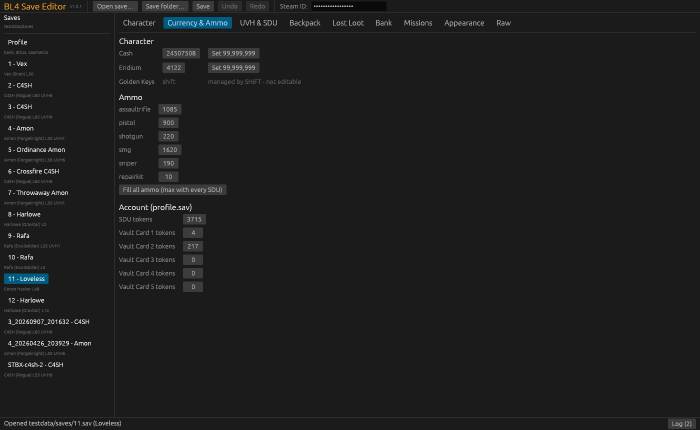 | 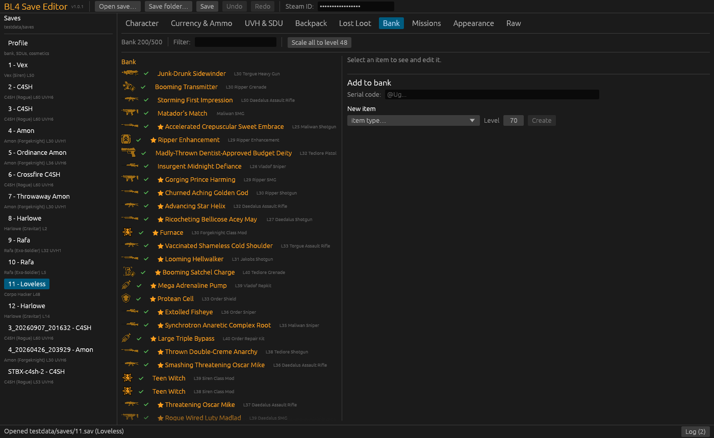 |
| 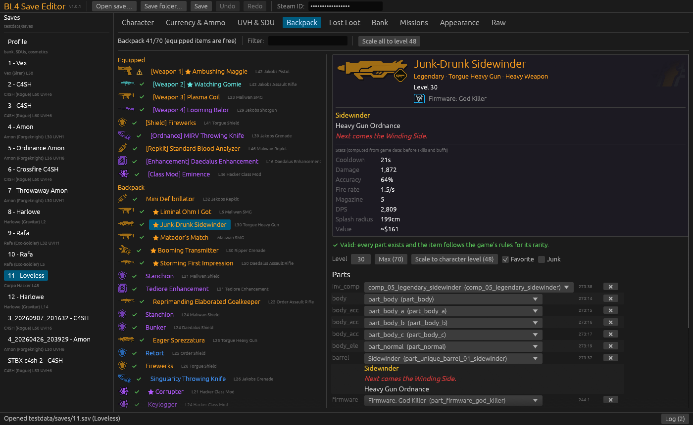 | 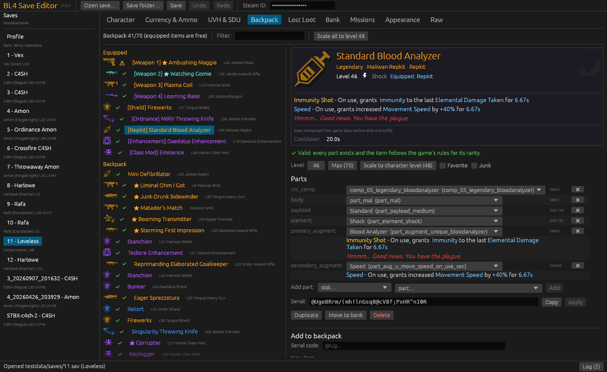 |

## Using it

1. Quit Borderlands 4 completely (saving is disabled while it runs).
2. **Turn off Steam Cloud for Borderlands 4** while you experiment, or accept the local copy when Steam asks after editing.
3. Run `BL4SaveEditor.exe`. Your save folder
   (`Documents\My Games\Borderlands 4\Saved\SaveGames\<steamid>\Profiles\client`)
   is found automatically. The Steam ID is taken from that folder name.
4. Pick a character, edit, press **Save** (Ctrl+S).

To restore a backup, copy it from `bl4editor_backups` over the original
`N.sav` / `profile.sav` and remove the `_date-time` part of the name.

## Stats

Weapon cards are computed from the game's own balance data (data tables,
attribute formulas, part aspects) and reproduce the in-game item card before
skills, class mods and other buffs: damage (and pellets), accuracy, fire rate
(burst-aware), magazine, reload time, DPS, elemental DPS and chance, splash
radius, crit damage, the full in-game name ("Watching Gomie": stat and
licensed-part prefixes) and an approximate sell value (within a few dollars).
The model:

* base damage = 6 × 1.09^level × barrel damage scale, × weapon-type, magazine
  and element scalars;
* every part adds stat points; a point is worth
  `Weapon_Stats[stat].Default × manufacturer column × Rarity_Balance[rarity].Stat_Scale`
  (rarity changes stats only through these points);
* accuracy, DPS and the element line use the game's own UI expressions
  (`weapon_accuracy_ui_compare`, `weapon_dps_estimate`, `weapon_ui_elemental_dps`).

It is checked against in-game cards of a pearlescent Jakobs AR, a legendary
Maliwan SMG, two (modded) Jakobs pistols, two Ripper snipers, three heavy
weapons and a Jakobs shotgun; those numbers are locked in by the tests in
`crates/bl4core/tests/`. Known gap: shotgun pellet damage is about 2% low. For shields, ordnance and repkits the base values are shown, and each
part's modifiers are listed when you hover its id in the parts table.

## Game updates and mods

The embedded database was generated from the game files installed when the
editor was built, **including installed mod paks** (their parts are flagged
"only exists with a mod installed"). After a game patch, regenerate it:

```
python tools/extract_game_data.py build/gamedata/installed
python tools/extract_game_data.py build/gamedata/vanilla --vanilla
python tools/build_db.py
```

then either rebuild the exe, or copy `data/bl4db.json.gz` next to
`BL4SaveEditor.exe`: a database file there overrides the embedded one.

Requirements for regenerating: Python 3.11, `oo2core_9_win64.dll` (Oodle,
shipped with retoc) and the `bl4.exe` NCS parser built from
[monokrome/bl4](https://github.com/monokrome/bl4) (`cargo build --release -p bl4-cli`).

## Building

Rust (stable, `x86_64-pc-windows-gnu`) with mingw-w64 on `PATH` (for `as`,
`windres` and gcc, which builds the C zlib used to write byte-identical saves):

```
cargo test -p bl4core --release
cargo build --release
```

The exe is `target\release\BL4SaveEditor.exe`.

## Layout

```
crates/bl4core   library: crypto, lossless YAML, item serial codec, game
                 database, item analysis/validation, stats, save edits
crates/app       the GUI (eframe/egui)
tools/           game-data extraction and database/icon builders (Python)
data/            bl4db.json.gz (game database), icons.bin (item-card icons)
research/        format notes measured on real saves
```

## How it was verified

* All 673 distinct item serials in the test saves decode and re-encode to the
  identical string; part edits keep the game's token layout.
* All 13 game-written test saves decrypt → parse → re-emit → re-encrypt to the
  identical bytes.
* Every edit operation is applied to copies of real saves, written, re-read
  and checked against the structural rules every game-written save follows.
* The validator flags none of the 654 game-generated items, and catches 100%
  of unknown-part, wrong-pool and duplicate-barrel mutations of them.
* Items built from scratch for every item type × rarity (683) have no errors.
* Weapon card numbers match in-game screenshots exactly (see Stats).

Not verified in game yet: UVH 7 unlock, cosmetic unlocks, story completion
without the game's own `final` objective records, shotgun damage (about 2%
low on the one card checked), and characters above level 60 written by the
game itself (the cap is read from the game data).
